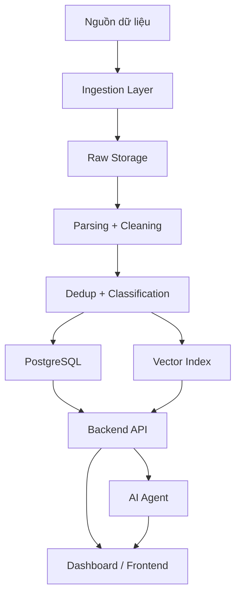
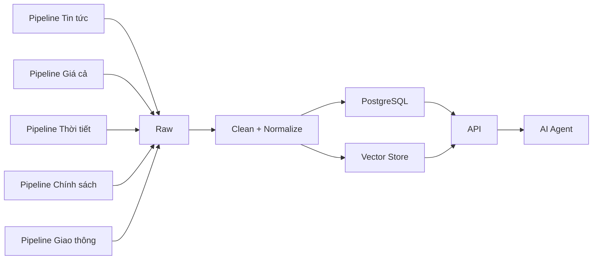

# Sơ đồ kiến trúc Mermaid

```mermaid
flowchart TD
    A[Nguồn dữ liệu] --> B[Ingestion Layer]
    B --> C[Raw Storage]
    C --> D[Parsing + Cleaning]
    D --> E[Dedup + Classification]
    E --> F[PostgreSQL]
    E --> G[Vector Index]
    F --> H[Backend API]
    G --> H
    H --> I[AI Agent]
    H --> J[Dashboard / Frontend]
    I --> J
```

## Sơ đồ 5 pipeline

```mermaid
flowchart LR
    A1[Pipeline Tin tức] --> B[Raw]
    A2[Pipeline Giá cả] --> B
    A3[Pipeline Thời tiết] --> B
    A4[Pipeline Chính sách] --> B
    A5[Pipeline Giao thông] --> B
    B --> C[Clean + Normalize]
    C --> D[PostgreSQL]
    C --> E[Vector Store]
    D --> F[API]
    E --> F
    F --> G[AI Agent]
```
